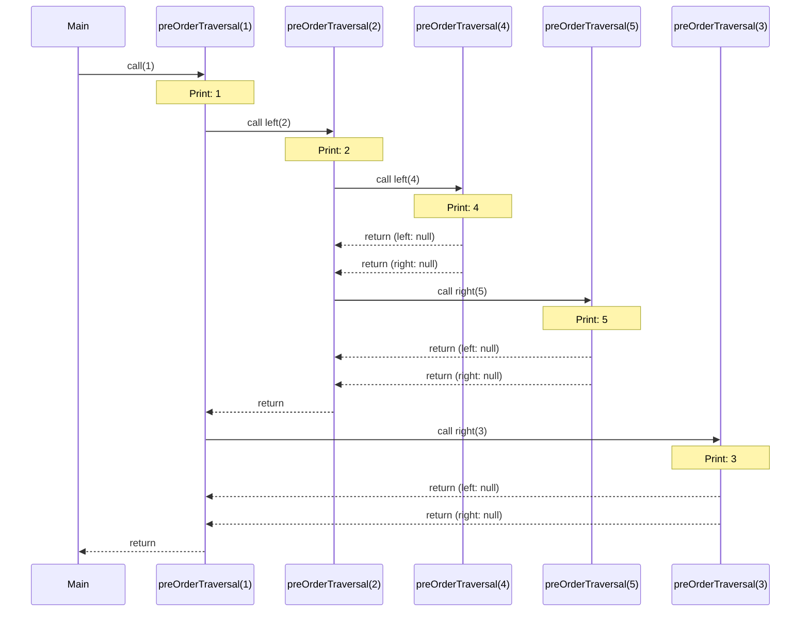
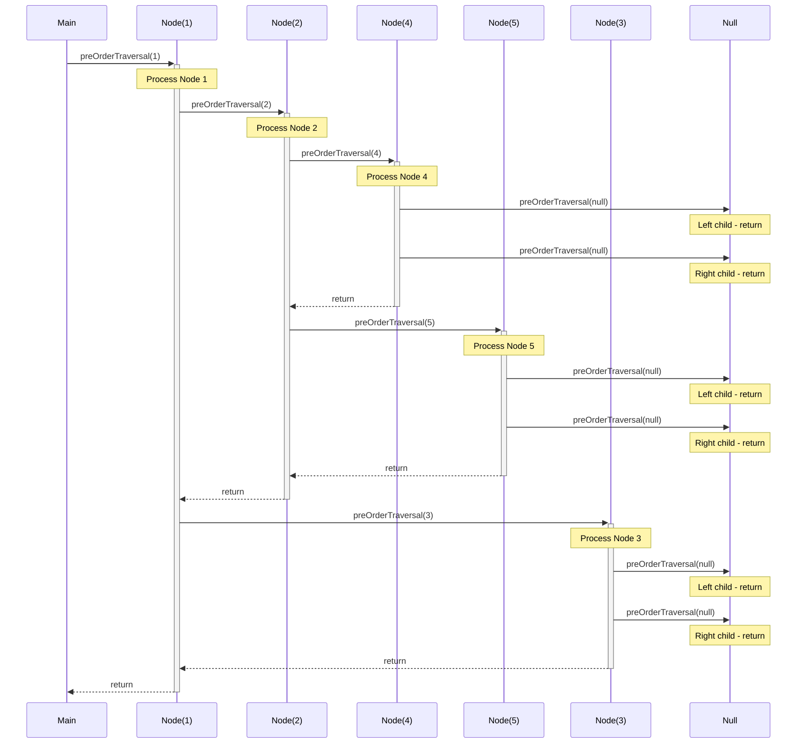
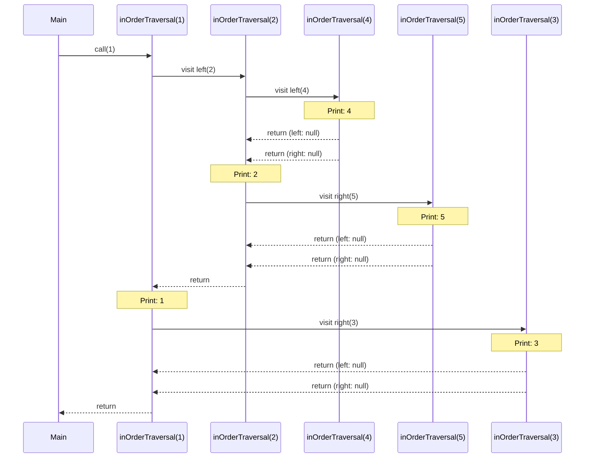
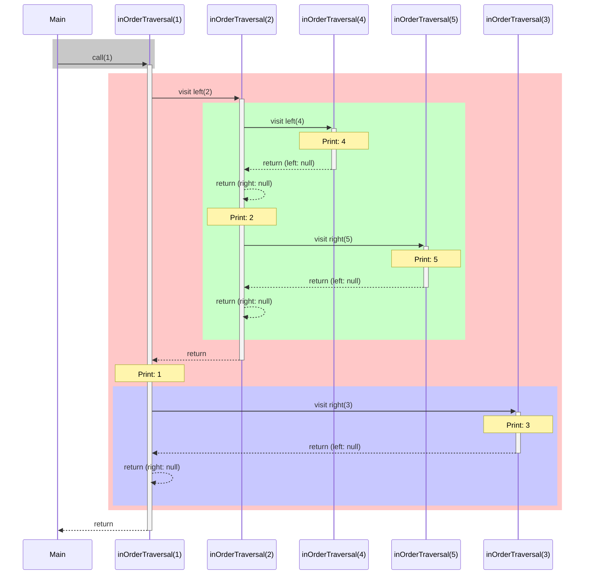
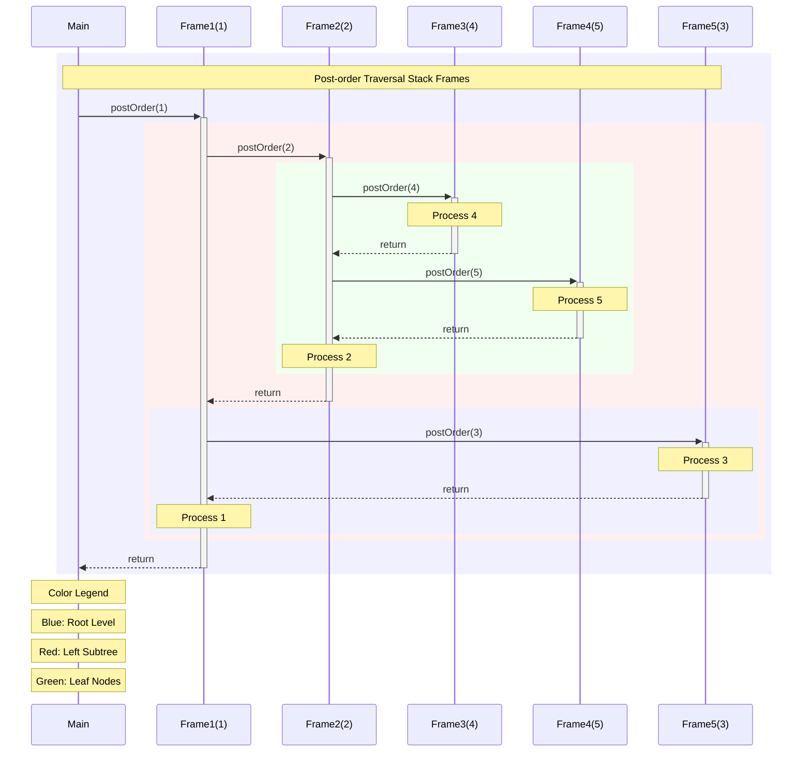
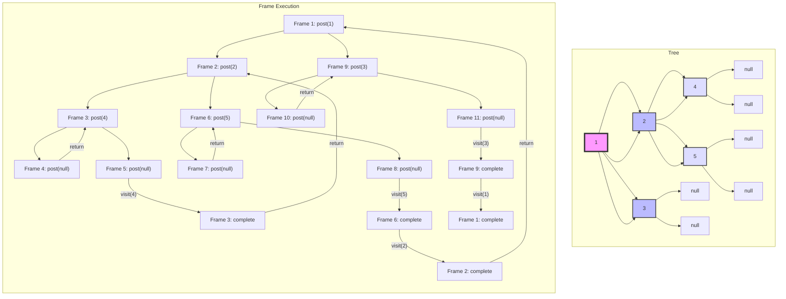
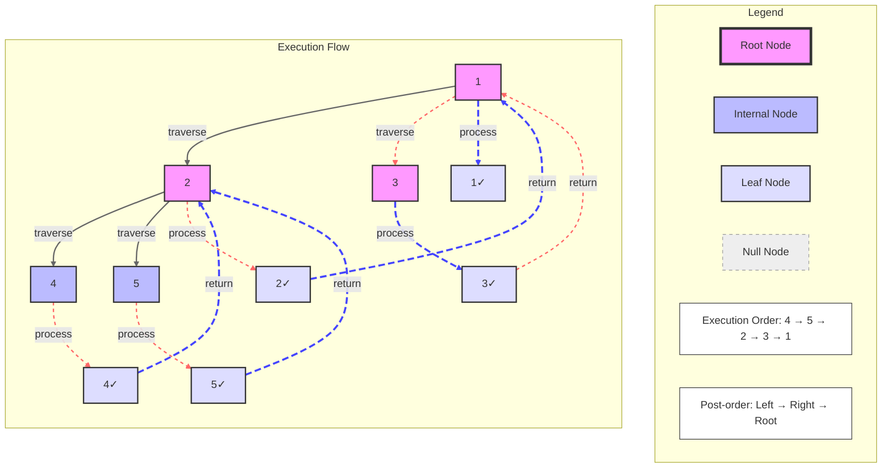
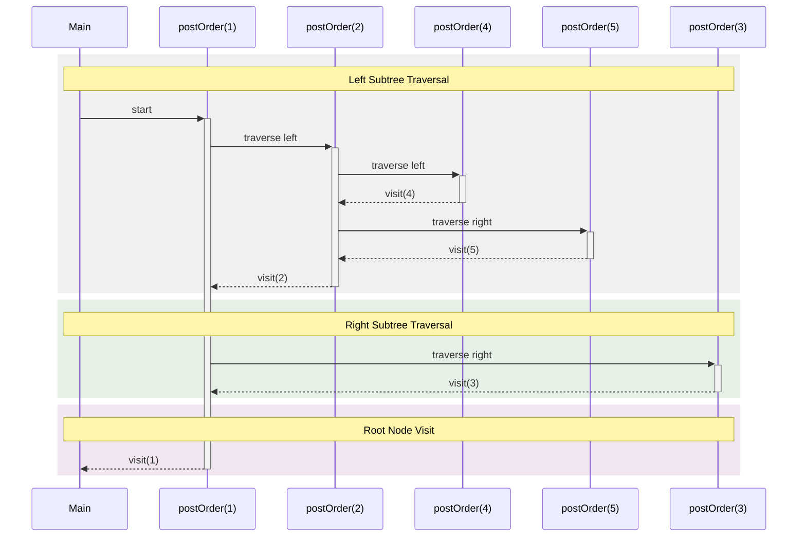
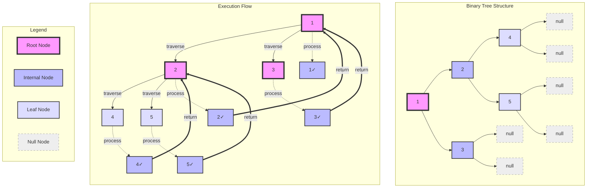

# Tree Traversal Algorithms


- Tree traversal algorithms are used to visit all nodes of a tree. There are three types of tree traversal algorithms:
1. Pre-order Traversal: Process the current node first, then recursively traverse the left subtree and right subtree.
2. In-order Traversal: Recursively traverse the left subtree first, then process the current node, and finally traverse the right subtree.
3. Post-order Traversal: Recursively traverse the left subtree first, then the right subtree, and finally process the current node.

 ```java
 public class Main {
    public static void main(String[] args) {
        BinaryTree tree = new BinaryTree();

        // Construct the binary tree manually
        //        1
        //       / \
        //      2   3
        //     / \
        //    4   5
        tree.root = new Node(1);             // Root node
        tree.root.left = new Node(2);        // Left child of root
        tree.root.right = new Node(3);       // Right child of root
        tree.root.left.left = new Node(4);   // Left child of node 2
        tree.root.left.right = new Node(5);  // Right child of node 2

        // Perform pre-order traversal (Root -> Left -> Right)
        // Expected output: 1 2 4 5 3
        System.out.println("Pre-order Traversal:");
        tree.preOrderTraversal(tree.root); // Starts from the root node

        // Perform in-order traversal  (Left -> Root -> Right) 
        // Expected output: 4 2 5 1 3
        System.out.println("\nIn-order Traversal:");
        tree.inOrderTraversal(tree.root);

        // Perform post-order traversal (Left -> Right -> Root)
        // Expected output: 4 5 2 3 1
        System.out.println("\nPost-order Traversal:");
        tree.postOrderTraversal(tree.root);
    }
}
```
## Pre-order Traversal
In pre-order traversal, the current node is processed first, then the left subtree, and finally the right subtree. The general algorithm for pre-order traversal is:

1. Process the current node.
2. Recursively traverse the left subtree.
3. Recursively traverse the right subtree.

# Pre-order Traversal in Java:
```java
public void preOrderTraversal(Node node) {
    if (node == null) return;
    System.out.print(node.data + " "); // Process current node first
    preOrderTraversal(node.left);      // Then traverse left subtree 
    preOrderTraversal(node.right);     // Finally traverse right subtree
}
```
# Pre-order Traversal Method Call Diagram



### Example
Given the following binary tree:
```
//        1
//       / \
//      2   3
//     / \
//    4   5
tree.root = new Node(1);             // Root node
tree.root.left = new Node(2);        // Left child of root
tree.root.right = new Node(3);       // Right child of root
tree.root.left.left = new Node(4);   // Left child of node 2
tree.root.left.right = new Node(5);  // Right child of node 2
```
# Pre Order Traversal Example Method Call Call Stack Control Flow Diagram
# Details : Each method call is represented by a solid arrow (->)
Each return is represented by a dashed arrow (-->)
The solid bars represent the activation of each method on the stack 
The activation bars are used to show the lifetime of each method on the stack


The pre-order traversal algorithm visits each node in the following order: 1 -> 2 -> 4 -> 5 -> 3. The output of the pre-order traversal algorithm is:

```
        1
       / \
      2   3
     / \
    4   5
```
```
Pre-order Traversal:
1 2 4 5 3
```

### Stack Frame Diagram for Pre-order Traversal
```
|---------------------|
| preOrderTraversal(1)|
|---------------------|
| preOrderTraversal(2)|
|---------------------|
| preOrderTraversal(4)|
|---------------------|
| preOrderTraversal(null)|
|---------------------|
| preOrderTraversal(null)|
|---------------------|
| preOrderTraversal(5)|
|---------------------|
| preOrderTraversal(null)|
|---------------------|
| preOrderTraversal(null)|
|---------------------|
| preOrderTraversal(3)|
|---------------------|
| preOrderTraversal(null)|
|---------------------|
| preOrderTraversal(null)|
|---------------------|
```

```
        1
       / \
      2   3
     / \
    4   5
```
# Pre Order Traversal Stack Frame Diagram


## In-order Traversal
In in-order traversal, the left subtree is recursively traversed first, then the current node is processed, and finally, the right subtree is traversed. The general algorithm for in-order traversal is:

1. Recursively traverse the left subtree.
2. Process the current node.
3. Recursively traverse the right subtree.
2. In-order Traversal:
```java
public void inOrderTraversal(Node node) {
    if (node == null) return;
    inOrderTraversal(node.left);
    System.out.print(node.data + " ");
    inOrderTraversal(node.right);
}
```
1. Traverse left subtree first
2. Then process current node
3. Finally traverse right subtree
```
        1
       / \
      2   3
     / \
    4   5
```
# In order Traversal Example Method Call Control Flow Diagram



# Stack Frame Diagram 

```java
|---------------------|
| inOrderTraversal(1) |
|---------------------|
| inOrderTraversal(2) |
|---------------------|
| inOrderTraversal(4) |
|---------------------|
| inOrderTraversal(null)|
|---------------------|
| inOrderTraversal(null)|
|---------------------|
| inOrderTraversal(5) |
|---------------------|
| inOrderTraversal(null)|
|---------------------|
| inOrderTraversal(null)|
|---------------------|
| inOrderTraversal(3) |
|---------------------|
| inOrderTraversal(null)|
|---------------------|
| inOrderTraversal(null)|
|----------------
```

<!-- TODO: Stack Frame Chart for In-order Traversal method and stack frame
 -->
 # In Order Traversal Sequence Diagram

## Details : Each method call is represented by a solid arrow (->)
Each return is represented by a dashed arrow (-->)
The printing operations are shown as notes above the respective method calls
The activation bars (vertical rectangles) show when each method is active on the stack
The activation bars are colored to differentiate between different methods

The complete execution flow results in printing: 4, 2, 5, 1, 3, which is the correct in-order traversal sequence

# Color Coded Stack Frame Diagram

The sequence diagram uses different colors to represent method execution levels:

- **Gray**: Main method execution
- **Light Red**: Root level - inOrderTraversal(1) and its scope
- **Light Green**: Left subtree - inOrderTraversal(2) and children (4,5)
- **Light Blue**: Right subtree - inOrderTraversal(3) execution

This color scheme helps visualize:
- Nested call hierarchy
- Stack frame lifetime
- Subtree traversal boundaries

The diagram clearly shows how recursion:
1. Processes the left subtree (green)
2. Returns to complete the root (red)
3. Finishes with the right subtree (blue)



<!-- TODO: Stack Frame Chart for Post-order Traversal method and stack frame
 -->

## Post-order Traversal
In post-order traversal, the left subtree is recursively traversed first, then the right subtree, and finally, the current node is processed. The general algorithm for post-order traversal is:

1. Recursively traverse the left subtree.
2. Recursively traverse the right subtree.
3. Process the current node.
3. Post-order Traversal:
```java
public void postOrderTraversal(Node node) {
    if (node == null) return;
    postOrderTraversal(node.left);      // Traverse left subtree first
    postOrderTraversal(node.right);     // Then traverse right subtree
    System.out.print(node.data + " ");  // Finally process current node
}
```


# Stack Frame Diagram

```java
|---------------------|
| postOrderTraversal(1)|
|---------------------|
| postOrderTraversal(2)|
|---------------------|
| postOrderTraversal(4)|
|---------------------|
| postOrderTraversal(null)|
|---------------------|
| postOrderTraversal(null)|
|---------------------|
| postOrderTraversal(5)|
|---------------------|
| postOrderTraversal(null)|
|---------------------|
| postOrderTraversal(null)|
|---------------------|
| postOrderTraversal(3)|
|---------------------|
| postOrderTraversal(null)|
|---------------------|
| postOrderTraversal(null)|
|---------------------|
```

## Complexity Analysis
The time complexity of tree traversal algorithms is O(n), where n is the number of nodes in the tree. 
The space complexity of tree traversal algorithms is O(h), where h is the height of the tree. 
The space complexity is O(h) because the recursive calls are stored on the stack, and the maximum depth of the stack is equal to the height of the tree. 
In the worst-case scenario, the height of the tree can be equal to the number of nodes in the tree, resulting in O(n) space complexity.


Based on the codebase context, I'll explain what a leaf node is in Java with specific references to the binary tree implementation shown:

A leaf node in Java is a node that has no children - both its left and right references are null. This is demonstrated in several ways in the codebase:

1. Node Class Implementation:
```java
class Node {
    int data;
    Node left, right;
    
    Node(int item) {
        data = item;
        left = right = null;  // Initializes both children as null
    }
}
```

2. Key Characteristics of Leaf Nodes:
- Both `left` and `right` references are null
- Can't have any children
- Are at the bottom level of the tree
- Store actual data values

3. Examples from the Codebase:
In the tree structure shown:
```
        1
       / \
      2   3
     / \
    4   5
```
Nodes 4, 5, and 3 are leaf nodes because:
- They have no children (both left and right are null)
- They are at the bottom of the tree structure
- This clearly indicates their special status as terminal nodes in the tree structure.



This diagram shows:

1. Color coding for different levels:
   - Blue: Root level operations
   - Red: Left subtree operations  
   - Green: Leaf node operations

2. Stack frame progression:
   - Main calls postOrder(1)
   - Frame1 calls postOrder(2)
   - Frame2 calls postOrder(4) 
   - Process node 4
   - Frame2 calls postOrder(5)
   - Process node 5
   - Process node 2
   - Frame1 calls postOrder(3)
   - Process node 3
   - Process node 1

3. Final traversal order: 4 -> 5 -> 2 -> 3 -> 1

The nested rectangles help visualize the stack frames and their lifetimes during execution.


## Summary
Tree traversal algorithms are used to visit all nodes of a tree. There are three types of tree traversal algorithms: pre-order traversal, in-order traversal, and post-order traversal. Pre-order traversal processes the current node first, then recursively traverses the left subtree and right subtree. In-order traversal recursively traverses the left subtree first, then processes the current node, and finally traverses the right subtree. Post-order traversal recursively traverses the left subtree first, then the right subtree, and finally processes the current node. The time complexity of tree traversal algorithms is O(n), and the space complexity is O(h), where n is the number of nodes in the tree and h is the height of the tree.
# Post Order Traversal Diagrams

 



# Post-order Traversal Sequence Diagram


# Post Order Traversal Sequence Diagram

# Note [Post-order Sequence: 4 → 5 → 2 → 3 → 1]

## Su mmary and Key Insights and Concepts of Binary Tree Traversals in Java: Pre-Order, Post-Order and In-Order.

Binary tree traversals are fundamental operations to visit all the nodes in a binary tree systematically. Two common types are **Pre-Order** and **Post-Order** traversals. Let's delve into each with specific examples in Java.

### Pre-Order Traversal

**Order of Operations:** 
1. **Visit the current node.**
2. Traverse the **left subtree**.
3. Traverse the **right subtree**.

**Use Cases:**
- Copying the tree.
- Prefix expression (Polish notation) in expression trees.

**Example Implementation:**

```java
// Java implementation of Pre-Order Traversal
class TreeNode {
    int val;
    TreeNode left, right;

    TreeNode(int item) {
        val = item;
        left = right = null;
    }
}

public class BinaryTree {
    TreeNode root;

    // Pre-Order Traversal: Root -> Left -> Right
    void preOrderTraversal(TreeNode node) {
        if (node == null)
            return;
        System.out.print(node.val + " ");      // Visit node
        preOrderTraversal(node.left);          // Traverse left
        preOrderTraversal(node.right);         // Traverse right
    }

    public static void main(String[] args) {
        BinaryTree tree = new BinaryTree();
        /* Construct the following binary tree
                  1
                /   \
               2     3
              / \     
             4   5    
        */
        tree.root = new TreeNode(1);
        tree.root.left = new TreeNode(2);
        tree.root.right = new TreeNode(3);
        tree.root.left.left = new TreeNode(4);
        tree.root.left.right = new TreeNode(5);

        System.out.println("Pre-Order Traversal:");
        tree.preOrderTraversal(tree.root); // Output: 1 2 4 5 3
    }
}
```

**Explanation:**
1. **Visit Node 1:** Print `1`.
2. **Traverse Left Subtree of 1 (Node 2):**
   - Print `2`.
   - Traverse Left Subtree of 2 (Node 4): Print `4`.
   - Traverse Right Subtree of 2 (Node 5): Print `5`.
3. **Traverse Right Subtree of 1 (Node 3):** Print `3`.

**Output:** `1 2 4 5 3`

### Post-Order Traversal

**Order of Operations:** 
1. Traverse the **left subtree**.
2. Traverse the **right subtree**.
3. **Visit the current node.**

**Use Cases:**
- Deleting the tree.
- Postfix expression (Reverse Polish notation) in expression trees.

**Example Implementation:**

```java
// Java implementation of Post-Order Traversal
class TreeNode {
    int val;
    TreeNode left, right;

    TreeNode(int item) {
        val = item;
        left = right = null;
    }
}

public class BinaryTree {
    TreeNode root;

    // Post-Order Traversal: Left -> Right -> Root
    void postOrderTraversal(TreeNode node) {
        if (node == null)
            return;
        postOrderTraversal(node.left);          // Traverse left
        postOrderTraversal(node.right);         // Traverse right
        System.out.print(node.val + " ");        // Visit node
    }

    public static void main(String[] args) {
        BinaryTree tree = new BinaryTree();
        /* Construct the following binary tree
                  1
                /   \
               2     3
              / \     
             4   5    
        */
        tree.root = new TreeNode(1);
        tree.root.left = new TreeNode(2);
        tree.root.right = new TreeNode(3);
        tree.root.left.left = new TreeNode(4);
        tree.root.left.right = new TreeNode(5);

        System.out.println("Post-Order Traversal:");
        tree.postOrderTraversal(tree.root); // Output: 4 5 2 3 1
    }
}
```

**Explanation:**
1. **Traverse Left Subtree of 1 (Node 2):**
   - Traverse Left Subtree of 2 (Node 4): Print `4`.
   - Traverse Right Subtree of 2 (Node 5): Print `5`.
   - Print `2`.
2. **Traverse Right Subtree of 1 (Node 3):** Print `3`.
3. **Visit Node 1:** Print `1`.

**Output:** `4 5 2 3 1`
## In-Order Traversal

**Order of Operations:**
1. **Traverse the left subtree.**
2. **Visit the current node.**
3. **Traverse the right subtree.**

**Use Cases:**
- Retrieving data in a sorted order from a Binary Search Tree (BST).
- Infix expression evaluation in expression trees.

### Example Implementation

```java
// Java implementation of In-Order Traversal
class TreeNode {
    int val;
    TreeNode left, right;

    TreeNode(int item) {
        val = item;
        left = right = null;
    }
}

public class BinaryTree {
    TreeNode root;

    // In-Order Traversal: Left -> Root -> Right
    void inOrderTraversal(TreeNode node) {
        if (node == null)
            return;
        inOrderTraversal(node.left);          // Traverse left
        System.out.print(node.val + " ");      // Visit node
        inOrderTraversal(node.right);         // Traverse right
    }

    public static void main(String[] args) {
        BinaryTree tree = new BinaryTree();
        /* Construct the following binary tree
                  1
                /   \
               2     3
              / \     
             4   5    
        */
        tree.root = new TreeNode(1);
        tree.root.left = new TreeNode(2);
        tree.root.right = new TreeNode(3);
        tree.root.left.left = new TreeNode(4);
        tree.root.left.right = new TreeNode(5);

        System.out.println("In-Order Traversal:");
        tree.inOrderTraversal(tree.root); // Output: 4 2 5 1 3
    }
}
```

### Explanation

1. **Traverse Left Subtree of 1 (Node 2):**
   - **Traverse Left Subtree of 2 (Node 4):** Print `4`.
   - **Visit Node 2:** Print `2`.
   - **Traverse Right Subtree of 2 (Node 5):** Print `5`.
2. **Visit Node 1:** Print `1`.
3. **Traverse Right Subtree of 1 (Node 3):** Print `3`.

**Output:** `4 2 5 1 3`

### Key Points

- **Time Complexity:** 
  - **O(n)**, where **n** is the number of nodes, since each node is visited once.
  
- **Space Complexity:** 
  - **O(h)**, where **h** is the height of the tree, due to the recursion stack.
  - In the worst case (skewed tree), **h** can be equal to **n**, resulting in **O(n)** space complexity.

### Improvements and Best Practices

- **Iterative Approach:** To optimize space, especially for very deep trees, consider using an iterative approach with an explicit stack.
  
  **Example:**
  
  ```java
  void inOrderTraversalIterative(TreeNode root) {
      Stack<TreeNode> stack = new Stack<>();
      TreeNode current = root;
      
      while (current != null || !stack.isEmpty()) {
          while (current != null) {
              stack.push(current);
              current = current.left;
          }
          current = stack.pop();
          System.out.print(current.val + " ");
          current = current.right;
      }
  }
  ```

- **Tail Recursion:** Some Java compilers optimize tail-recursive methods, but it's not guaranteed. Be cautious with very deep recursion to avoid `StackOverflowError`.
  
- **Null Checks:** Always ensure nodes are not null to prevent runtime exceptions.

- **Modular Code:** Separate traversal logic from other functionalities to enhance code readability and maintainability.

### Practical Applications

- **Binary Search Trees (BST):** In-order traversal of a BST retrieves nodes in ascending order, making it useful for operations like sorting or verifying the integrity of the tree.
  
- **Expression Trees:** Used in compilers and calculators to evaluate expressions written in infix notation.

- **Data Serialization:** In-order traversal can be used to serialize binary trees to ensure a consistent order of elements.

By understanding and implementing in-order traversal alongside pre-order and post-order traversals, you can effectively navigate and manipulate binary trees in your Java applications.

### Key Points

- **Time Complexity:** Both traversals have a time complexity of **O(n)**, where **n** is the number of nodes, since each node is visited once.
  
- **Space Complexity:** 
  - **O(h)**, where **h** is the height of the tree, due to the recursion stack.
  - In the worst case (skewed tree), **h** can be equal to **n**, resulting in **O(n)** space complexity.

### Improvements and Best Practices

- **Iterative Approach:** To optimize space, especially for very deep trees, consider using an iterative approach with an explicit stack.
  
- **Tail Recursion:** Some Java compilers optimize tail-recursive methods, but it's not guaranteed. Be cautious with very deep recursion to avoid `StackOverflowError`.

- **Null Checks:** Always ensure nodes are not null to prevent runtime exceptions.

By understanding and implementing these traversal methods, you can effectively navigate and manipulate binary trees in your Java applications.

