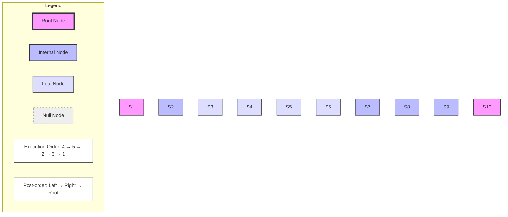

# Tree Traversal Algorithms

Tree traversal algorithms are used to visit all nodes of a tree. There are three types of tree traversal algorithms:
1. Pre-order Traversal: Process the current node first, then recursively traverse the left subtree and right subtree.
2. In-order Traversal: Recursively traverse the left subtree first, then process the current node, and finally traverse the right subtree.
3. Post-order Traversal: Recursively traverse the left subtree first, then the right subtree, and finally process the current node.

 ```java
 public class Main {
    public static void main(String[] args) {
        BinaryTree tree = new BinaryTree();

        // Construct the binary tree manually
        //        1
        //       / \
        //      2   3
        //     / \
        //    4   5
        tree.root = new Node(1);             // Root node
        tree.root.left = new Node(2);        // Left child of root
        tree.root.right = new Node(3);       // Right child of root
        tree.root.left.left = new Node(4);   // Left child of node 2
        tree.root.left.right = new Node(5);  // Right child of node 2

        // Perform pre-order traversal (Root -> Left -> Right)
        // Expected output: 1 2 4 5 3
        System.out.println("Pre-order Traversal:");
        tree.preOrderTraversal(tree.root); // Starts from the root node

        // Perform in-order traversal  (Left -> Root -> Right) 
        // Expected output: 4 2 5 1 3
        System.out.println("\nIn-order Traversal:");
        tree.inOrderTraversal(tree.root);

        // Perform post-order traversal (Left -> Right -> Root)
        // Expected output: 4 5 2 3 1
        System.out.println("\nPost-order Traversal:");
        tree.postOrderTraversal(tree.root);
    }
}
```
## Pre-order Traversal
In pre-order traversal, the current node is processed first, then the left subtree, and finally the right subtree. The general algorithm for pre-order traversal is:

1. Process the current node.
2. Recursively traverse the left subtree.
3. Recursively traverse the right subtree.

1. Pre-order Traversal:
```java
public void preOrderTraversal(Node node) {
    if (node == null) return;
    System.out.print(node.data + " "); // Process current node first
    preOrderTraversal(node.left);      // Then traverse left subtree 
    preOrderTraversal(node.right);     // Finally traverse right subtree
}
```
# Pre-order Traversal Example Stack Frame Diagram


### Example
Given the following binary tree:
```
//        1
//       / \
//      2   3
//     / \
//    4   5
tree.root = new Node(1);             // Root node
tree.root.left = new Node(2);        // Left child of root
tree.root.right = new Node(3);       // Right child of root
tree.root.left.left = new Node(4);   // Left child of node 2
tree.root.left.right = new Node(5);  // Right child of node 2
```
# Pre Order Traversal Example Method Call Control Flow Diagram


The pre-order traversal algorithm visits each node in the following order: 1 -> 2 -> 4 -> 5 -> 3. The output of the pre-order traversal algorithm is:
```
Pre-order Traversal:
1 2 4 5 3
```

### Stack Frame Diagram for Pre-order Traversal
```
|---------------------|
| preOrderTraversal(1)|
|---------------------|
| preOrderTraversal(2)|
|---------------------|
| preOrderTraversal(4)|
|---------------------|
| preOrderTraversal(null)|
|---------------------|
| preOrderTraversal(null)|
|---------------------|
| preOrderTraversal(5)|
|---------------------|
| preOrderTraversal(null)|
|---------------------|
| preOrderTraversal(null)|
|---------------------|
| preOrderTraversal(3)|
|---------------------|
| preOrderTraversal(null)|
|---------------------|
| preOrderTraversal(null)|
|---------------------|
```
# Pre Order Traversal Stack Frame Diagram


## In-order Traversal
In in-order traversal, the left subtree is recursively traversed first, then the current node is processed, and finally, the right subtree is traversed. The general algorithm for in-order traversal is:

1. Recursively traverse the left subtree.
2. Process the current node.
3. Recursively traverse the right subtree.
2. In-order Traversal:
```java
public void inOrderTraversal(Node node) {
    if (node == null) return;
    inOrderTraversal(node.left);       // Traverse left subtree first
    System.out.print(node.data + " "); // Then process current node
    inOrderTraversal(node.right);      // Finally traverse right subtree
}
```

# In order Traversal Example Method Call Control Flow Diagram
 

# Stack Frame Diagram 

```java
|---------------------|
| inOrderTraversal(1) |
|---------------------|
| inOrderTraversal(2) |
|---------------------|
| inOrderTraversal(4) |
|---------------------|
| inOrderTraversal(null)|
|---------------------|
| inOrderTraversal(null)|
|---------------------|
| inOrderTraversal(5) |
|---------------------|
| inOrderTraversal(null)|
|---------------------|
| inOrderTraversal(null)|
|---------------------|
| inOrderTraversal(3) |
|---------------------|
| inOrderTraversal(null)|
|---------------------|
| inOrderTraversal(null)|
|----------------
```

<!-- TODO: Stack Frame Chart for In-order Traversal method and stack frame
 -->
 # In Order Traversal Sequence Diagram

## Details : Each method call is represented by a solid arrow (->)
Each return is represented by a dashed arrow (-->)
The printing operations are shown as notes above the respective method calls
The activation bars (vertical rectangles) show when each method is active on the stack
The activation bars are colored to differentiate between different methods

The complete execution flow results in printing: 4, 2, 5, 1, 3, which is the correct in-order traversal sequence

# Color Coded Stack Frame Diagram

The sequence diagram uses different colors to represent method execution levels:

- **Gray**: Main method execution
- **Light Red**: Root level - inOrderTraversal(1) and its scope
- **Light Green**: Left subtree - inOrderTraversal(2) and children (4,5)
- **Light Blue**: Right subtree - inOrderTraversal(3) execution

This color scheme helps visualize:
- Nested call hierarchy
- Stack frame lifetime
- Subtree traversal boundaries

The diagram clearly shows how recursion:
1. Processes the left subtree (green)
2. Returns to complete the root (red)
3. Finishes with the right subtree (blue)


<!-- TODO: Stack Frame Chart for Post-order Traversal method and stack frame
 -->

## Post-order Traversal
In post-order traversal, the left subtree is recursively traversed first, then the right subtree, and finally, the current node is processed. The general algorithm for post-order traversal is:

1. Recursively traverse the left subtree.
2. Recursively traverse the right subtree.
3. Process the current node.
3. Post-order Traversal:
```java
public void postOrderTraversal(Node node) {
    if (node == null) return;
    postOrderTraversal(node.left);      // Traverse left subtree first
    postOrderTraversal(node.right);     // Then traverse right subtree
    System.out.print(node.data + " ");  // Finally process current node
}
```


# Stack Frame Diagram

```java
|---------------------|
| postOrderTraversal(1)|
|---------------------|
| postOrderTraversal(2)|
|---------------------|
| postOrderTraversal(4)|
|---------------------|
| postOrderTraversal(null)|
|---------------------|
| postOrderTraversal(null)|
|---------------------|
| postOrderTraversal(5)|
|---------------------|
| postOrderTraversal(null)|
|---------------------|
| postOrderTraversal(null)|
|---------------------|
| postOrderTraversal(3)|
|---------------------|
| postOrderTraversal(null)|
|---------------------|
| postOrderTraversal(null)|
|---------------------|
```

## Complexity Analysis
The time complexity of tree traversal algorithms is O(n), where n is the number of nodes in the tree. The space complexity of tree traversal algorithms is O(h), where h is the height of the tree. The space complexity is O(h) because the recursive calls are stored on the stack, and the maximum depth of the stack is equal to the height of the tree. In the worst-case scenario, the height of the tree can be equal to the number of nodes in the tree, resulting in O(n) space complexity.

## Summary
Tree traversal algorithms are used to visit all nodes of a tree. There are three types of tree traversal algorithms: pre-order traversal, in-order traversal, and post-order traversal. Pre-order traversal processes the current node first, then recursively traverses the left subtree and right subtree. In-order traversal recursively traverses the left subtree first, then processes the current node, and finally traverses the right subtree. Post-order traversal recursively traverses the left subtree first, then the right subtree, and finally processes the current node. The time complexity of tree traversal algorithms is O(n), and the space complexity is O(h), where n is the number of nodes in the tree and h is the height of the tree.


 

# Post-order Traversal Sequence Diagram
